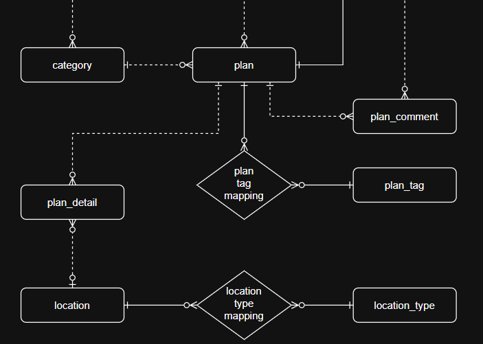
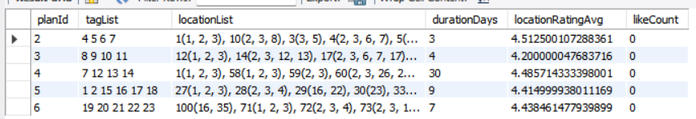
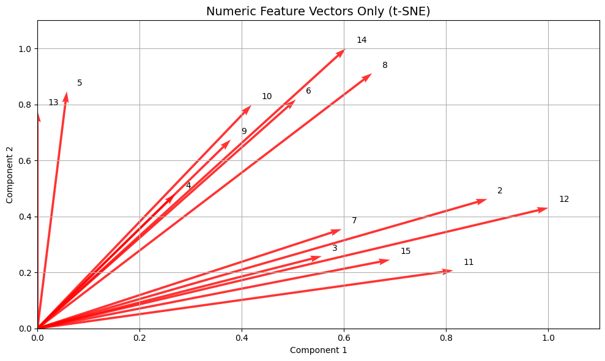
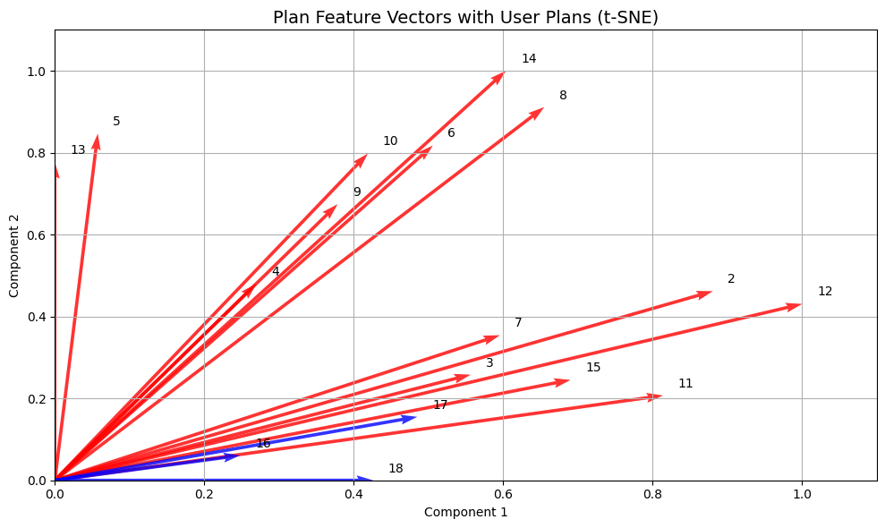

# 추천 알고리즘 프로세스

### 1. plan 연관 데이터 추출

#### 1-1. 관련 엔터티만 추출

데이터를 추출 전 현재 ERD에서 plan과 연관된 엔터티를 모두 찾아줍니다. trip with 프로젝트에서 plan과 연관된 엔터티는 다음과 같습니다.

`plan`, `plan_tag_mapping`, `plan_tag`, `plan_detail`, `location`, `location_type_mapping` 그리고 `location_type` 을 이용하여 해당 plan이 어느 태그를 지니고, 어느 여행지를 방문하는 지에 따라 벡터값을 구하기로 결정하였습니다.

> `avatar_like_plan`, `plan_comment` 엔터티도 있지만, 머신러닝이 아닌 콘텐츠 기반 추천 시스템이기에 제외하고 진행하였습니다.

#### 1-2. 관련 엔터티의 컬럼 종류

관련 엔터티의 모든 컬럼 내용은 다음과 같습니다. 이 중에서 모든 컬럼을 사용하는 것이 아닌, plan을 잘 표현해 줄 수 있는 컬럼만 추출할 예정입니다.

-   **`plan`의 컬럼**:
    -   `createdAt`, `updatedAt`, `deletedAt`, `isDeleted`, `planId`, `planTitle`, `planMainImage`, `status`, `travelStartDate`, `travelEndDate`, `likesCount`, `totalPrice`, `categoryId`, `avatarId`
-   **`plan_tag`의 컬럼**:
    -   `pTagId`, `pTagName`
-   **`plan_detail`의 컬럼**:
    -   `createdAt`, `updatedAt`, `deletedAt`, `isDeleted`, `detailId`, `startTime`, `endTime`, `detailTitle`, `price`, `priceType`, `currency`, `notes`, `planId`, `locationId`
-   **`location`의 컬럼**:
    -   `locationId`, `placeId`, `locationName`, `address`, `latitude`, `longitude`, `locationRating`
-   **`location_type`의 컬럼**:
    -   `typeId`, `type`

#### 1-3. 사용할 컬럼 정리 (벡터 생성에 활용)

-   **`plan`**:

    -   `travelStartDate`, `travelEndDate` → 여행 기간(`durationDays`) 계산  
        → 여행 일정의 길이는 여행의 성격을 결정짓는 중요한 요소입니다. 예를 들어, 짧은 여행은 도심 위주, 긴 여행은 장거리 이동 포함 등 일정의 구성 방식이 달라질 수 있기 때문에 추천 유사도 판단에 중요한 feature입니다.

    -   `totalPrice` → 정규화된 수치형 feature  
        → 여행의 소비 성향(예산 규모)을 반영합니다. 유사한 가격대의 여행을 추천하는 것은 사용자의 여행 스타일(저가/프리미엄 여행 등)을 고려하는 데 도움이 됩니다.

    -   `likesCount` → **우선순위 정렬용 feature (벡터에는 포함하지 않음)**  
        → 추천 벡터에는 포함하지 않고, 추천 유사도 계산 이후 **좋아요 수가 많은 플랜을 우선적으로 노출**하는 데 사용합니다.  
        → 해당 feature를 벡터에 포함할 경우, 사용자가 작성 중인 최근 plan과의 유사도를 비교하기에 낮은 좋아요를 가진 plan이 추천 될 수도 있습니다. 이러한 단점을 보완하고자 벡터에서는 제거하고, 정렬용으로 사용하여 사용자 평판이 좋은 플랜을 우선 노출시킬 수 있습니다.

-   **`plan_tag`**:

    -   `pTagId` → **One-hot Encoding**
        → 태그는 여행 플랜의 핵심 주제를 나타냅니다. TF-IDF를 통해 자주 등장하지만 의미가 덜한 일반 태그는 낮은 가중치를 두고, 특이한 태그는 유사도 계산에서 더 높은 영향을 주어 정밀한 추천이 가능해집니다.
        → `pTagName`을 택하지 않은 이유는 텍스트보다 ID 기반 인코딩이 메모리 효율과 정확도 측면에서 우수하기 때문입니다.

-   **`plan_detail`**:

    -   `priceType` → **One-hot Encoding**  
        → 여행 상세 일정에서 비용의 유형(음식, 쇼핑, 입장권 등)을 분류합니다. 비용 유형은 사용자의 여행 스타일(맛집, 관광, 액티비티 중심 등)을 반영하므로 추천 유사도 계산에 중요한 역할을 합니다.

-   **`location`**:

    -   `locationId` → **One-hot Encoding**  
        → 여행 플랜이 실제 어떤 장소들을 포함하는지를 명확하게 표현합니다. 동일 장소를 방문하는 플랜끼리는 유사한 추천 대상이 될 수 있기 때문에 선택하였습니다.
        → `type`을 택하지 않은 이유는 `pTagId` 사용 이유와 같습니다.

    -   `locationRating` → 평균 평점 수치형 feature  
        → 각 `locationRating`들을 사용하여 평균값을 도출하고, 그 값을 유사도 계산에 사용할 예정입니다. 특정 plan이 여러 location을 포함하고, 이 location들의 평균 평점을 활용합니다.

-   **`location_type`**:

    -   `typeId` → **One-hot Encoding**  
        → 장소 구성 비중(쇼핑 위주, 문화 위주, 자연 위주 등)을 판단할 수 있습니다. 장소 유형을 벡터화하면 사용자가 선호하는 여행 패턴(특성)에 유사한 구성의 여행을 추천할 수 있습니다.
        → `type`을 택하지 않은 이유는 `pTagId` 사용 이유와 같습니다.

#### 1-4. View 생성

> 해당 뷰는 샘플 데이터를 활용한 뷰입니다.

`tagList`는 `tagId`들을 공백을 간격으로 저장한 컬럼입니다. `locationList`의 경우는 `locationId(typeId)`들의 집합을 나타냅니다. 이때 `typeId`는 괄호 안에서 `,` 간격으로 분리될 수 있습니다.

### 2. 추출된 데이터에서 모든 plan의 벡터 생성

위 벡터는 샘플 plan 데이터를 모두 벡터로 시각화 한 이미지입니다. **T-SNE**를 활용하여 `1-4`에서 보여진 데이터를 벡터화 하였습니다다.

> 사용자가 최근에 방문한 plan들은 제외

### 3. 사용자가 최근 접근한 plan 벡터 생성(본인 plan 포함)

위 벡터는 `2`번에서 언급한 샘플 plan들의 벡터(빨간색)과 사용자가 최근에 방문한 plan들의 벡터(파란색)을 하나의 좌표에 시각화한 이미지입니다. 사용자가 방문한 plan들도 **T-SNE**를 활용하여 벡터화 하였습니다. 이제 이 plan들과 가장 가까운 plan들이 우선적으로 조회되도록 합니다.

### 4. 나머지 plan 벡터들과 코사인 유사도 계산

| userPlanId | similarRank | similarPlanId | similarityScore |
| ---------- | ----------- | ------------- | --------------- |
| 16         | 1           | 2             | 0.9420          |
| 16         | 2           | 11            | 0.8367          |
| 16         | 3           | 12            | 0.7638          |
| 17         | 1           | 3             | 0.9107          |
| 17         | 2           | 7             | 0.8994          |
| 17         | 3           | 15            | 0.8931          |
| 18         | 1           | 15            | 0.8237          |
| 18         | 2           | 10            | 0.8214          |
| 18         | 3           | 9             | 0.8210          |

### 5. 유사도 높은 순으로 추천 결과 반환
